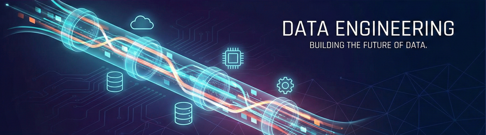

  

<h1 align="center">Hi there, I'm Fabio D'Alessandro 👋</h1>
<h3 align="center">Junior Data Engineer | Student (L-31) | ETL Specialist</h3>

  
  

---

### 👨‍💻 About Me

Sono uno studente di **Informatica per le Aziende Digitali (L-31)** con una forte passione per i dati e le architetture backend.
Il mio percorso è **ibrido**: ho iniziato "sporcandomi le mani" con sistemi legacy (IBM iSeries/AS400) per poi evolvermi verso moderne pipeline dati in **Python** e **Cloud architectures**.

Mi distinguo per un approccio pragmatico: non scrivo solo codice, risolvo colli di bottiglia.

> 🚀 **Key Achievement:** Ho ridotto del **50%** i tempi di elaborazione della reportistica aziendale progettando pipeline ETL ibride (SQL + Python) e ottimizzando query complesse su grandi moli di dati.

---

## 📄 CV Aggiornato

👉 **[Scarica il mio Curriculum Vitae (PDF)](./2026_02_cv_de_Fabio_Dalessandro.pdf)**

---

### 🛠️ Tech Stack & Tools

**Data Engineering & Analytics**
 

**Backend & Development**
 

**Legacy & Specialized**
 

---

### 📚 Current Learning Focus

Sto costantemente aggiornando le mie competenze per colmare il gap tra on-premise e cloud:

- [cite_start]🌱 **Deepening:** Machine Learning algorithms (Scikit-learn) & Advanced Python[cite: 29].
- 🔭 **Exploring:** Cloud Data Engineering (AWS/Azure) & Containerization (Docker).
- [cite_start]💻 **Consolidating:** C# Advanced & .NET Architecture[cite: 37].

---

  <i>"Data is the new oil, but only if you know how to refine it."</i>

