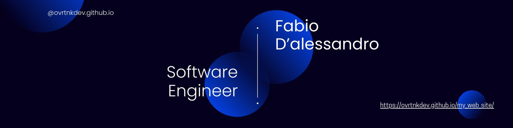

  

<h1 align="center">Hi there, I'm Fabio D'Alessandro 👋</h1>
<h3 align="center">Software Developer | SQL, Python, ETL | Studente Informatica L-31</h3>

  
  
  

---

### 👨‍💻 About Me

Software developer con un background nello sviluppo backend (C#/.NET, Python) e nell'ottimizzazione di infrastrutture dati
(SQL). Attualmente operativo presso Accenture, dove integro la logica di sviluppo software con l'automazione enterprise tramite
Blue Prism, estendendo le funzionalità dei robot con codice custom C#/.NET. Studente di Informatica per le Aziende Digitali (L-
31), unisco un forte approccio metodologico alla risoluzione di problemi complessi, con l'obiettivo di progettare soluzioni
backend scalabili,sicure e data-driven.

>Mi distinguo per un approccio pragmatico: non scrivo solo codice, risolvo colli di bottiglia.

---

## 📄 CV Aggiornato

👉 **[Scarica il mio Curriculum Vitae (PDF)](./07_26_CV_Fabio_DAlessandro.pdf)**

---

### 🛠️ Tech Stack & Tools

**Data Engineering & Analytics**
 

**Backend & Development**
 

**Legacy & Specialized**
 

---

  <i>"Data is the new oil, but only if you know how to refine it."</i>

